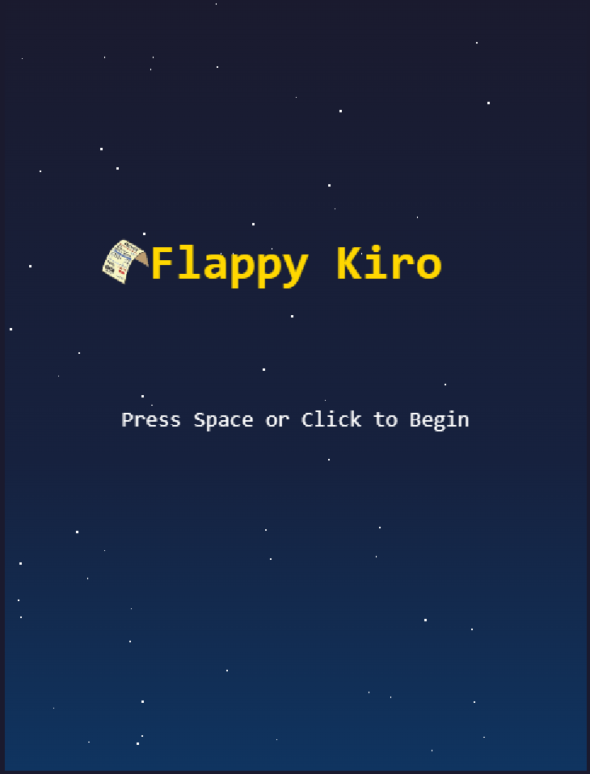

# 🧾 Flappy Kiro

Un juego arcade de desplazamiento infinito estilo retro, inspirado en Flappy Bird. Controla a **Facturita** — nuestro icónico personaje — navegando a través de una serie interminable de tuberías. Implementado en **HTML5, CSS y JavaScript puro** — sin dependencias externas, sin pasos de compilación, sin servidor requerido.



---

## 🎮 Cómo jugar

| Acción | Control |
|--------|---------|
| Iniciar partida | `Espacio` o clic en el canvas |
| Volar hacia arriba | `Espacio` o clic en el canvas |
| Reiniciar tras Game Over | `Espacio` o clic en el canvas |

**Objetivo:** Guía a **Facturita** por el mayor número de tuberías posible sin chocar con ellas ni con los bordes de la pantalla. Cada tubería superada suma 1 punto.

---

## 🚀 Cómo ejecutar

### Opción 1 — Abrir directamente en el navegador

Simplemente abre `index.html` en cualquier navegador moderno. No necesitas servidor ni instalación.

### Opción 2 — Servidor local (recomendado para desarrollo)

```bash
# Con Python
python -m http.server 8080

# Con Node.js
npx serve .
```

Luego abre: `http://localhost:8080`

### Opción 3 — GitHub Pages (link público)

Visita la versión en línea en:
```
https://TU_USUARIO.github.io/flappy-kiro/
```

---

## 📁 Estructura del proyecto

```
flappy-kiro/
├── index.html              # Juego completo (único archivo necesario)
├── flappy-kiro.test.html   # Suite de tests de propiedades (fast-check)
├── assets/
│   ├── facturita1.png      # Facturita ascendente (subiendo)
│   ├── facturita2.png      # Facturita descendente (bajando)
│   ├── jump.wav            # Sonido de salto
│   └── game_over.mp3       # Sonido de game over
├── img/
│   └── example-ui.png      # Captura de pantalla del juego
└── README.md
```

---

## 🏗️ Arquitectura

El juego sigue una **arquitectura de game loop** impulsada por `requestAnimationFrame`. Cada frame el loop:

1. Actualiza física (velocidad + posición)
2. Desplaza tuberías y fondo
3. Verifica colisiones
4. Actualiza puntuación
5. Renderiza todo en el canvas

```
┌─────────────────────────────────────────────────────┐
│                   Game Loop (rAF)                   │
│                                                     │
│  ┌──────────┐  ┌──────────┐  ┌──────────────────┐  │
│  │ Physics  │  │  Pipes   │  │    Background    │  │
│  │ Engine   │  │ Spawner  │  │    Scroller      │  │
│  └────┬─────┘  └────┬─────┘  └────────┬─────────┘  │
│       │              │                 │             │
│  ┌────▼─────────────▼─────────────────▼──────────┐  │
│  │              Collision Detector               │  │
│  └────────────────────┬──────────────────────────┘  │
│                       │                             │
│  ┌────────────────────▼──────────────────────────┐  │
│  │                  Renderer                     │  │
│  └───────────────────────────────────────────────┘  │
│                                                     │
│  ┌──────────────────┐   ┌──────────────────────┐    │
│  │  Input Handler   │   │    Audio Manager     │    │
│  └──────────────────┘   └──────────────────────┘    │
└─────────────────────────────────────────────────────┘
```

### Máquina de estados

```
         Espacio / Clic
              │
         ┌────▼────┐
         │  START  │
         └────┬────┘
              │ Espacio / Clic
         ┌────▼────┐
         │ PLAYING │◄──────────────┐
         └────┬────┘               │
              │ colisión           │ Espacio / Clic
         ┌────▼────┐               │
         │  GAME   ├───────────────┘
         │  OVER   │
         └─────────┘
```

---

## 🧩 Módulos

| Módulo | Responsabilidad |
|--------|----------------|
| `PhysicsEngine` | Aplica gravedad, impulso de salto y actualiza posición |
| `PipeSpawner` | Genera, desplaza y elimina pares de tuberías |
| `CollisionDetector` | Detecta colisiones AABB entre Facturita, tuberías y bordes |
| `ScoreManager` | Registra y resetea la puntuación |
| `Renderer` | Dibuja fondo, tuberías, Facturita y overlays de UI |
| `AudioManager` | Carga y reproduce efectos de sonido con fallback silencioso |
| `InputHandler` | Escucha eventos de teclado y clic |
| `BackgroundScroller` | Gestiona el desplazamiento continuo del fondo |

---

## ⚙️ Constantes del juego

| Constante | Valor | Descripción |
|-----------|-------|-------------|
| `CANVAS_WIDTH` | 480 px | Ancho del canvas |
| `CANVAS_HEIGHT` | 640 px | Alto del canvas |
| `GRAVITY` | 0.5 px/frame² | Aceleración gravitacional |
| `FLAP_IMPULSE` | -9 px/frame | Velocidad vertical al saltar |
| `MAX_FALL_SPEED` | 12 px/frame | Velocidad máxima de caída |
| `PIPE_SPEED` | 3 px/frame | Velocidad de desplazamiento de tuberías |
| `PIPE_WIDTH` | 60 px | Ancho de cada tubería |
| `GAP_HEIGHT` | 150 px | Alto del hueco entre tuberías |
| `SPAWN_INTERVAL` | 90 frames | Intervalo entre aparición de tuberías |
| `BG_SPEED` | 2 px/frame | Velocidad de desplazamiento del fondo |

---

## 🎨 Assets

| Asset | Archivo | Cuándo se usa |
|-------|---------|---------------|
| Facturita ascendente | `assets/facturita1.png` | `vy < 0` (Facturita subiendo) |
| Facturita descendente | `assets/facturita2.png` | `vy >= 0` (Facturita bajando) |
| Sonido de salto | `assets/jump.wav` | Al presionar Espacio/clic durante el juego |
| Sonido game over | `assets/game_over.mp3` | Al colisionar |

> Si los sprites de Facturita no cargan, el juego muestra automáticamente un rectángulo de color como fallback — el juego siempre es jugable.

---

## 🧪 Tests

El archivo `flappy-kiro.test.html` contiene una suite completa de **property-based tests** usando [fast-check](https://github.com/dubzzz/fast-check). Ábrelo directamente en el navegador para ejecutarlos.

### Propiedades verificadas

| # | Propiedad | Módulo | Requisitos |
|---|-----------|--------|------------|
| 1 | La gravedad incrementa monotónicamente la velocidad descendente | PhysicsEngine | 2.1, 2.5 |
| 2 | El salto siempre produce velocidad ascendente | PhysicsEngine | 2.2 |
| 3 | La velocidad terminal nunca se supera | PhysicsEngine | 2.5 |
| 4 | La posición del hueco siempre está dentro de los límites | PipeSpawner | 3.2 |
| 5 | La puntuación es monótonamente no decreciente y correcta | ScoreManager | 5.1, 5.4 |
| 6 | El sprite correcto se selecciona según la dirección de velocidad | Renderer | 6.1, 6.2, 6.3 |
| 7 | La detección AABB es simétrica y completa | CollisionDetector | 4.1 |
| 8 | La puntuación se resetea a 0 al reiniciar | ScoreManager | 5.4 |

Cada test ejecuta **100 iteraciones** con entradas generadas aleatoriamente.

---

## 🛡️ Manejo de errores

- **Audio:** Todos los errores de carga y reproducción se capturan silenciosamente — el juego continúa sin audio si el navegador no lo soporta.
- **Sprites de Facturita:** Si una imagen falla al cargar, el renderer dibuja un rectángulo de color del mismo tamaño que el hitbox.
- **Canvas no soportado:** Si `getContext("2d")` retorna `null`, se muestra un mensaje de texto alternativo.

---

## 🌐 Compatibilidad

Funciona en cualquier navegador moderno sin instalación ni servidor:

- ✅ Chrome / Chromium
- ✅ Firefox
- ✅ Safari
- ✅ Edge

---

## 📄 Licencia

Ver [LICENCE.md](LICENCE.md)
